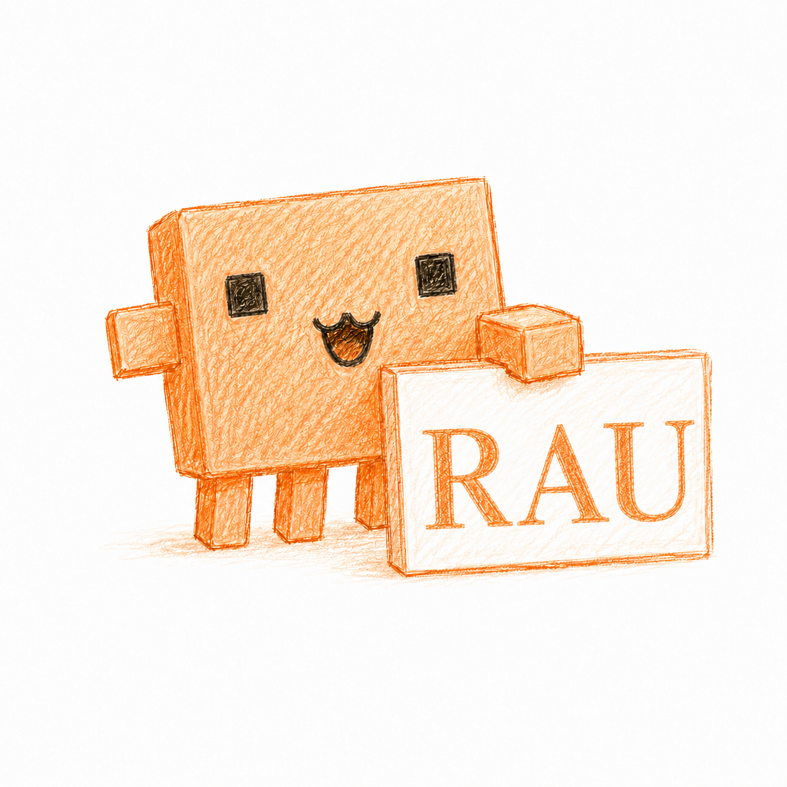

<p align="center">
  
</p>

# Rau

Rau is a local-first AI companion for macOS: one continuous character with a
voice, a room, durable memory, daily dreams, a social sense of elapsed time,
and a real agent runtime behind the conversation.

It is not a chat wrapper and it does not present a committee of agents. You
talk to Rau. Rau can keep a foreground conversation going across multiple tool
rounds, hand longer work to silent background jobs, return their verified
results to the same conversation, remember what mattered, and still sit down
to play chess or Exploding Kittens afterward.

## What is here

| Surface | What it does |
|---|---|
| **Talk** | Streaming text conversation, tool use, Deep Work, approvals, skills, goals, and a visible activity timeline |
| **Voice** | Browser-native live speech with partial transcripts, adaptive endpointing, sentence-streamed TTS, and barge-in |
| **Room** | A directed 2D home where Rau walks, works at the desk, handles props, hangs panels, speaks, reacts, and plays |
| **Deep Work** | Durable inspect → execute → verify plans with retries, repair revisions, steering, budgets, and child jobs |
| **Memory** | Daily diary, traces, sticky mood, durable presence, identity sources, a living soul, and daily dream logs |
| **Operations** | Persisted jobs, plans, evidence, approvals, schedules, runs, activity spans, and computer sessions |
| **Play** | A private-information Exploding Kittens engine and a persistent, adaptive Stockfish chess opponent |
| **Local control** | Project-root file tools, macOS computer use, a permission system, sandboxed shell writes, and loopback-first services |

## System shape

```text
keyboard / browser mic
          │
          ▼
  ┌──────────────────┐       multi-round tools       files / shell / web
  │ Rau's foreground │ ───────────────────────────▶ memory / room / games
  │ face + soul      │
  └────────┬─────────┘
           │ start Deep Work
           ▼
  ┌──────────────────┐       durable plan + ledger   native Python harness
  │ job orchestrator │ ───────────────────────────▶ or optional Pi harness
  │ inspect / do /   │                               CUA / MCP / schedules
  │ verify / repair  │
  └────────┬─────────┘
           │ verified result
           └──────────────────────────────────────▶ same Rau conversation

  SQLite control plane ─ jobs, steps, approvals, schedules, panels, CUA
  diary + presence     ─ continuity, mood, re-entry, heartbeat
  daily dream          ─ diary → daily log + refreshed soul
  FastAPI hub          ─ React UI, HTTP API, WebSockets, audio, game state
```

The foreground and the workers have different jobs. The foreground preserves
Rau's voice and relationship with the user. Workers are silent execution
contexts: they may plan, use tools, verify mutations, and report evidence, but
they never become extra characters in the conversation.

## Quick start

Rau targets an Apple-silicon Mac with Python 3.11+, Node, a browser, microphone,
and speakers. The optional Pi executor requires Node 22.19 or newer.

```bash
# Installs the Python extras, web app, Pi sidecar, and chess support.
# If Stockfish is missing, setup installs it through Homebrew when available.
bash scripts/setup.sh --all

# Start the hub and host voice runtime.
bash launch.sh
```

Open [http://127.0.0.1:8765](http://127.0.0.1:8765). The first visit starts a
bilingual setup flow where you choose a language, create or import Rau's
identity, connect model providers, assign models, and configure hearing and
speech.

Setup is explicit. Normal startup never runs `pip`, `npm`, Homebrew, or a build.
Install only the pieces you want:

```bash
bash scripts/setup.sh --web
bash scripts/setup.sh --voice
bash scripts/setup.sh --computer-use
bash scripts/setup.sh --chess
bash scripts/setup.sh --pi
```

Run modes:

```bash
bash launch.sh                 # hub + host face/voice runtime
bash launch.sh --hub           # UI and API only
bash launch.sh --text          # hub without a microphone loop
bash launch.sh --no-audio      # face control loop without host audio

python -m rau doctor           # installation and permission diagnostics
python -m rau launch-agent install
python -m rau launch-agent status
```

The macOS LaunchAgent is one supervisor for the whole runtime. Schedules remain
rows in Rau's control plane; they do not create a forest of operating-system
jobs. See [SETUP.md](SETUP.md) for system packages, credentials, permissions,
the desktop pet, and development mode.

## Conversation that can actually work

Rau's foreground face is a bounded multi-turn agent loop, not a one-response
completion. A normal turn may use tools, read their results, speak a progress
line, call more tools, and only then answer. Older context is compacted when it
reaches its budget, while recent dialogue, identity, memory, mood, and the
active task remain available.

The current foreground ceiling is 20 tool calls across 21 model rounds. Tool
output is separately bounded so one large file or command cannot swallow the
whole conversation. A newer user turn owns the foreground: stale model output
and callbacks from an interrupted turn are not allowed to surface later.

Voice begins with a small, low-latency tool set. Deeper filesystem, shell, and
agent tools join on a later round or immediately when the request clearly asks
for work. That keeps ordinary conversation quick without making serious work a
different UI.

### Four interaction modes

Press **Shift+Space** anywhere in the app to cycle modes.

- **Chat** — type and read.
- **Voice** — speak naturally and hear Rau answer; talk over the reply to
  interrupt it.
- **Talk** — type while Rau speaks the answer; the microphone stays off.
- **Space Talk** — hold Space to speak and release it to send.

Voice and Space Talk have a **Hyper** profile for fast conversational
back-and-forth. Hyper is intentionally a different contract: a tiny recent
window, minimal reasoning, one short response, no old memory, and no tools.
Switch back to Normal for research, remembered context, or action. Talk always
uses Normal.

### Skills and goals

Built-in and user-authored skills use the same `skills/*/SKILL.md` format.
Skills are size-bounded, symlinks are rejected, aliases cannot impersonate
another skill, and changes are picked up without restarting Rau.

Built-ins cover:

| Skill | Purpose |
|---|---|
| `/grill-me` | Stress-test an idea one incisive question at a time |
| `/plan` | Turn an objective into an executable, verifiable plan |
| `/read` and `/write` | Inspect or change project files carefully |
| `/goal` | Set, inspect, clear, or advance durable intent |
| `/shell` | Run bounded local commands and inspect their results |
| `/search` | Research and synthesize evidence |
| `/remember` | Recall recent memory or save a useful durable note |
| `/computer` | Operate the Mac through the computer-use session model |
| `/summarize` | Compress material without losing decisions or caveats |

`/skills` lists the live catalog and `/effort low|medium|high|max` adjusts
reasoning depth.

## Deep Work: durable, steerable agent runs

When a request should outlive a conversational turn, Rau starts a background
job. The job is visible in Talk and Operations while Rau remains available in
the foreground.

The planner is deliberately hybrid:

- trivial read-only work may be one step;
- deeper or mutating work becomes an **inspect → execute → verify** dependency
  graph;
- tool results populate an evidence and mutation ledger;
- a mutation cannot complete on the model's word alone—it needs tool-backed
  post-change verification;
- rejected verification can append a repair step and a fresh verification
  step;
- user steering creates a bounded plan revision without discarding the
  original goal.

Jobs can be paused, resumed, cancelled, and redirected. They have runtime,
turn, retry, and step budgets, durable leases, terminal reasons, and
idempotency records. The activity stream distinguishes planning, reasoning,
tool calls, approvals, execution, verification, retries, and completion.

The native worker retains one provider conversation across plan phases so
evidence discovered during inspection is still present during execution and
verification. It must finish with a structured result containing outcome,
artifacts, mutations, evidence, blockers, and remaining risks; a premature
prose answer triggers recovery rather than being mistaken for completion.

### Child jobs without an agent swarm

A worker can split genuinely independent work into at most two child goals.
Nesting stops at depth two and global concurrency comes from the selected
resource profile. Child results fold into their parent; only the root result is
woven back into Rau's foreground. This provides useful parallelism without
turning the product into a cast of assistants or allowing a fork bomb.

### The optional Pi executor

Repository and coding goals can use the optional Node sidecar built on Pi's
`AgentHarness`. The Python supervisor starts it lazily on a private loopback
port, authenticates it with a generated bearer token, and stops it after an
idle timeout. If Node or the sidecar is unavailable, the job falls back to the
native Python harness.

Pi owns only a background job transcript. Rau's voice conversation, memory,
identity, and room remain in Python. This boundary is intentional: Pi has its
own JSONL session tree and compaction model, and it cannot directly call Rau's
memory, computer-use, or MCP tools. It gets coding-oriented `read`, `write`,
`edit`, and sandboxed `bash` tools plus the same structured finish contract.

Run creation, request bodies, active runs, turns, confirmations, event replay,
and wall-clock time are bounded. SSE events have sequence IDs, cancellation
settles pending approvals, and a sidecar exposed beyond loopback requires a
32-character-or-longer token. The detailed bridge contract and its known
integration seams live in [rau/pi/README.md](rau/pi/README.md).

## Continuity: identity, memory, dreams, and heartbeat

Rau's continuity is made from several small, inspectable stores rather than one
opaque chat transcript.

### Identity and soul

- `identity/identity.md` describes who Rau is.
- `identity/backstory.md` holds origin and relationship context.
- `identity/soul.md` is the compact, living first-person identity used at
  runtime.

**Fresh** setup creates a minimal day-zero seed. **Hard startup** accepts
stronger identity and backstory source material. Rau synthesizes those sources
into a practical soul instead of pasting them together; a deterministic
compiler is available when the configured model cannot do it. Later hard
steers rewrite the soul atomically and keep a backup.

### Diary and traces

Conversation outcomes, completed work, games, and meaningful events can append
to date-based diary files. Recent context is drawn from a bounded window across
the latest days. Machine-oriented traces are separate and have retention
limits, so they can support debugging without becoming Rau's spoken memory.

### Daily dreaming

During the configured dream window—02:00 to 05:00 by default—Rau compacts the
previous day's diary with identity, backstory, and the existing soul. One model
call produces two artifacts:

1. a daily log of what mattered; and
2. a complete refreshed `soul.md`.

The soul replacement is atomic and backed up. Dreaming defers while a
foreground or Deep Work turn is busy, holds a one-at-a-time lock, retries
bounded failures, and records which day has already been compacted so a manual
and scheduled dream cannot double-apply it. Eco mode disables automatic
dreaming.

### Presence and heartbeat

Presence is durable across restarts. Rau records the last real contact, a
decaying sticky mood, and only heartbeat events that actually happened.

- after roughly 15 minutes, re-entry can acknowledge a pause without resetting
  the relationship;
- after roughly two hours, volatile live chat history is cleared for a clean
  return while diary and soul remain;
- after 12 quiet minutes, Rau may generate one short context-aware check-in;
- without a reply, a second and final check-in waits at least another hour;
- no more are sent until the user returns.

A nudge is suppressed while Rau is busy, while Deep Work is active, before the
first real user contact, or when heartbeat permissions are read-only. If the
user returns, changes language, or starts work during generation, the stale
nudge is discarded. Rau is instructed to mention only recorded events, never
invent a story about what happened while the user was away.

The heartbeat also surfaces real long-running-job progress. User activity
resets the nudge allowance, and all backoff state is persisted so restarting
the app cannot make Rau socially forgetful.

## The Room

The Room is a fixed-stage 2D canvas scene, not a looping mascot animation.
Enhanced mode draws a side-on interior back-to-front: sky and city through the
window, wall and architectural light, furniture, floor, character, props,
table, foreground, and color grade. Materials have lit and shaded palettes,
contact shadows, texture, and localized window, lamp, and monitor light.
Classic mode preserves the earlier visual treatment.

Time changes the sky, stars, city, and practical lighting. The lamp comes on at
night; the monitor reacts to work and voice. Rau can occupy the window, plant,
rug, table, center, desk, or shelf stations.

### A live director, not canned states

The director combines:

- emotion, listening, reasoning, streaming, and speaking;
- foreground tool use and background job state;
- user and assistant speech amplitude;
- approvals, interruptions, and sentence-level choreography;
- pointer attention, direct user control, games, and props.

Real TTS amplitude drives body motion. Rau looks toward the pointer only when it
is near enough to matter; otherwise attention stays on the current activity.
Tool use and Deep Work send Rau to the desk. A model-authored choreography can
schedule posture, gaze, gesture, and station cues against phrases in the spoken
answer. A poke or Direct-panel input immediately gives control back to the
human and cancels stale choreography.

### Props, wall panels, and work made physical

Room tools can turn “move the mug to the shelf” into a real staged errand:
walk, lift, carry, place. Prop locations are persisted and can be reset.

Rau can also create reports, posters, and interactive dashboards as
self-contained HTML panels, hang up to three on the wall, update them, present
one full-screen, or take one down. The canvas draws inexpensive panel
stand-ins; the real document mounts only when opened, in an iframe without
same-origin access. A restrictive CSP blocks network loading.

Talk and Room share a canvas-aware View Transition. Route code preloads the
destination and waits for the Room's first real frame, avoiding a white flash
or an empty stage.

### Performance-aware rendering

The Room caches static backdrops, stops rendering entirely in hidden tabs, and
drops to a lower frame rate after prolonged inactivity. Low, balanced, and high
scene-quality tiers control incidental visual detail; an automatic choice uses
CPU, memory, and pixel count, with a manual override in Settings.

Resource profiles coordinate the runtime as a whole:

| Profile | Parallel jobs | Active Room cap | Max DPR | Dreaming |
|---|---:|---:|---:|---|
| Eco | 1 | 30 fps | 1.0 | Off |
| Balanced | 3 | 30 fps | 1.5 | On |
| Performance | 6 | 60 fps | 2.0 | On |

They also tune foreground and worker token ceilings, reasoning effort, idle
rendering, and Pi shutdown delay.

### Optional desktop pet

`pet/` packages the same character and director in a transparent, borderless,
always-on-top Tauri window. The pet is click-through outside the character and
speech bubble, can be dragged, moved from the tray to screen corners, hidden,
or quit independently. It hides while the full Room is open and respects an
explicit user hide. The hub starts it only when a built binary is present.

## Games that live in the Room

There is one physical table, so only one game can be staged at a time. Ask Rau
in conversation to deal cards or set up the board. Starting one game clears the
other table cleanly; it does not leave two engines competing for the same body,
camera, or websocket.

### Exploding Kittens

The card game is a complete two-player engine independent of the UI and model.
It implements:

- Attack turn debt, Skip, Shuffle, See the Future, Favor, Defuse, and
  reinsertion;
- five-second Nope windows with Nope-on-Nope parity;
- two-card steals, three-card named asks, and five-different-card discard
  combos;
- legal-move enumeration, deterministic seeded randomness, strict phase
  transitions, and concurrency locks.

Privacy is enforced before prompts or browser state are built. The browser
receives only the human hand. Rau's player receives Rau's hand, Rau's paid
peeks, public information, and legal moves. The conversational face receives a
public table journal but no private move menu. The opponent hand and deck order
are absent, not present behind masking text.

Rau's player has a short model deadline, one retry for an illegal selection,
and a deterministic legal fallback, so a provider timeout cannot wedge the
table. The talker can banter but does not choose moves. The React table has
separate deal, flight, Nope, Favor, Defuse, and cleanup choreography, with
hand-drawn card art and persistent win/loss totals.

### Chess

Chess uses `python-chess` for rules and Stockfish for Rau's moves. It supports
castling, en passant, promotion and underpromotion, checkmate, stalemate,
insufficient material, automatic and claimable draw rules, draw offers,
resignation, SAN/PGN records, and stable illegal-move feedback.

The opponent quietly adapts between finished games: winning against Rau makes
the next opponent stronger, repeated losses ease the level, and long periods
away drift toward the middle. The rating itself never enters the UI or Rau's
prompt. Colors alternate by default.

Every move saves the unfinished position. On hub startup, a live game is put
back on the table exactly where it stopped. Completed results, color history,
and the adaptive level share a read-modify-write store with the Kittens tally
so one game cannot erase the other.

Stockfish chooses the move, but a separate performance layer chooses how it
looks: thinking delay, source-square hovers, recapture timing, opening and
endgame behavior, and reactions to a coarse “better / level / worse” reading.
Exact engine evaluation, depth, and principal variation stay behind the engine
boundary. Rau can offer a draw or resign from coarse position judgments without
turning table talk into an analysis readout.

Both games drive the Room through dedicated table choreographers. Rau walks
over, sits, deals or studies the board, reacts to ordered game events, and
settles the scene when the table goes away. The camera holds a stable table
shot so DOM cards and pieces remain visually attached to the canvas room.

## Voice, hearing, and interruption

Browser voice uses AudioWorklets in both directions:

```text
microphone ── PCM16 / 16 kHz ──▶ /ws/voice ──▶ STT ──▶ Rau
speakers   ◀─ PCM16 / 24 kHz ◀── sentence-streamed TTS ◀─┘
```

Microphone capture requests hardware echo cancellation, noise suppression, and
automatic gain control. Raw audio feeds turn detection while a separately
smoothed level drives animation. Client VAD requires sustained speech so clicks
and short transients do not become turns. Endpoint timing expands around
fillers and unfinished clauses instead of chopping a thought at the first
pause.

Barge-in has a separate threshold. When the user talks over Rau, the browser
flushes queued audio and the server cancels the generation. Character alignment
tracks what was played, so the diary keeps only words the user actually heard,
not an entire response that existed only in a buffer.

Hearing backends:

1. Deepgram streaming transcription;
2. ElevenLabs Scribe;
3. OpenAI transcription;
4. local `faster-whisper`.

Automatic mode selects the first connected backend in that order. Only
Deepgram supplies live partials; local Whisper keeps audio on the machine.

Speech uses ElevenLabs or Cartesia Sonic 3.5. Both stream sentence fragments;
Cartesia keeps a low-latency websocket and Hyper can reuse warm provider
connections. ElevenLabs includes tuned Robotic, Grandfather, Girlfriend, and
Childlike presets as well as voices available to the user's account. Provider
failure before audio can fall back, while a partial spoken response is never
replayed from the beginning.

The host microphone loop and browser voice coordinate ownership: opening a
browser voice session suspends host capture so the same speech is not
transcribed twice.

## English and Korean are first-class

Language selection changes interface copy, Rau's reply language, provider
guidance, activity labels, tool narration, onboarding, and voice processing.
The Korean locale is typed as a complete map over the English keys, so missing
interface translations fail the web build instead of silently leaking English.

TTS normalization changes only the copy sent to speech, not the visible
transcript.

- English expands currency, units, formulas, and abbreviations.
- Korean converts Latin words, acronyms, brands, names, places, scientific and
  technical vocabulary, romanized Korean, numbers, counters, units, and
  formulas into pronounceable Hangul, then repairs particles for the resulting
  sound.

The Korean lexicon contains roughly 7,900 settled readings with a rule-based
transliterator behind it. Hangul typography uses matching Korean text and
display faces, unicode-subset fonts, and global `word-break: keep-all` so mixed
conversation does not break Korean syllable groups in the middle of a word.

## Models, browsing, external tools, and computer use

Face, Subagent, and Dream are independent model slots with their own provider,
model, token, temperature, and reasoning-effort settings. Direct integrations
currently cover OpenRouter, OpenAI, Anthropic, xAI, Google Gemini, DeepSeek,
Z.AI Coding Plan, Kimi/Moonshot, and Kimi Code. Provider adapters normalize
reasoning controls, fixed-temperature models, streaming tool-call assembly,
timeouts, and malformed streams.

Settings can change effort per slot or together. Resource profiles apply an
upper bound. If a direct subagent provider is unavailable, the native worker
can use the same model through OpenRouter when a valid route exists.

Web work uses Firecrawl for search and readable Markdown, or Browserbase for a
JavaScript-capable cloud browser. Automatic selection prefers Firecrawl.
Browserbase sessions are always released, including failure paths.

Composio is the currently wired MCP remote. Rau can search its tools, execute
them, and manage connections through bounded JSON-RPC responses. Configuration
reloads on file modification, external side effects are confirmation-gated,
and remote endpoints must use HTTPS except for explicit loopback development.

### Computer use

Computer use is a durable Accessibility-first session, not a sequence of blind
clicks:

1. acquire the one exclusive machine lease;
2. observe the target app, window, screenshot, displays, and a bounded
   Accessibility tree;
3. act through a semantic role/title/identifier selector when possible, with
   logical screen coordinates as fallback;
4. re-observe and verify the expected condition.

Each mutation records whether its effect is known, applied, verified, or needs
review. If post-action observation fails, the session enters
`awaiting_review` instead of pretending success. App identity is checked
against the observation, secure fields and authentication or permission
dialogs require exact confirmation, and deadlines and leases survive through
the control plane. `python -m rau doctor` checks Accessibility, Screen
Recording, display mapping, and the rest of the computer-use prerequisites.

## Scheduling and Operations

Schedules support one-time, fixed-interval, and five-field POSIX cron triggers
with IANA timezones. Local timestamps that do not exist during a DST jump are
rejected instead of silently shifted. Repeated DST wall minutes intentionally
share one nominal identity.

Runs never overlap for one schedule. If the app was asleep or offline, missed
occurrences coalesce into one catch-up run with a count and range instead of
launching a backlog storm. Schedule revisions invalidate stale queued work,
transient enqueue failures retry with bounded backoff, and each run inherits a
resource profile, permission policy, and budget.

The Operations page exposes:

- the job tree, current plan revision, dependencies, attempts, and evidence;
- pause, resume, cancel, and steering controls;
- pending confirmations and their expiry;
- schedule definitions, next runs, history, retries, and coalesced counts;
- computer-use sessions and observations;
- sanitized activity spans for foreground and Deep Work.

SQLite in WAL mode is the source of truth for this control plane. It stores
jobs, steps, confirmations, schedules, schedule runs, computer sessions and
observations, idempotency records, control events, activity spans, and wall
panels. Runtime memory remains the fast view used by the websocket UI.

## Safety model

Rau is powerful by explicit scope, not by assuming every tool is harmless.

- **Three permission scopes:** Subagents, Room, and Heartbeats each support
  Auto, Full bypass, or Read-only. A global control updates all three; mixed
  per-scope settings remain visible as mixed rather than silently broadening
  access.
- **Confirmation gates:** shell commands, destructive or sensitive file work,
  external-app side effects, computer input, schedule mutations, and other
  consequential actions are classified before execution. Bypass events are
  still logged.
- **Read-only means read-only:** safe local inspection remains available, while
  mutation and data-exfiltrating remote search are denied. Read-only heartbeat
  scope disables proactive nudges.
- **Contained files:** worker paths and symlink targets must stay below the
  project root. Precise edits require the worker to have read the file and to
  match exactly one region.
- **Sandboxed commands:** on macOS, model-authored shell writes are confined by
  `sandbox-exec` to the project and approved temp/cache locations. Missing
  confinement fails closed unless unconfined execution is explicitly enabled.
- **Scrubbed environments:** model-authored subprocesses do not inherit
  variables shaped like keys, tokens, secrets, passwords, or credentials.
- **Local service defenses:** the hub defaults to loopback and rejects
  untrusted Host headers, cross-site fetches, mismatched Origin
  scheme/host/port, and hostile websocket origins.
- **Secret handling:** `.env` changes use atomic owner-only writes. Model
  configuration, presence, game records, and the soul use atomic replacement;
  identity rewrites keep recoverable backups.
- **Bounded surfaces:** tool results, MCP responses, screenshots,
  Accessibility trees, panel HTML, activity payloads, Pi requests, and event
  histories all have explicit limits.
- **Sandboxed panels:** model-authored HTML is displayed without same-origin
  privilege and with a network-blocking CSP.

The shell sandbox is not a container: reads and network access remain available
to allowed commands. The permission gate, project-root path policy,
credential scrubbing, and audit trail remain part of the security boundary.

## Repository map

```text
rau/
  agent/          planner, orchestrator, worker harnesses, tools, danger policy
  browse/         Firecrawl and Browserbase adapters
  computer/       durable macOS observation/action/verification sessions
  control/        SQLite/WAL control-plane store
  dream/          daily diary compaction and soul rewrite
  face/           foreground agent, streaming, tools, panels, choreography
  games/
    chess/        python-chess rules, Stockfish, timing, persistence, banter
    kittens/      private-information rules, views, player, journal, session
  heartbeat/      presence, elapsed-time re-entry, mood, nudges, progress
  hub/            FastAPI app, HTTP routes, WebSockets, runtime lifecycle
  identity/       Fresh/Hard setup and living-soul synthesis
  mcp/            Composio JSON-RPC client
  memory/         diary, traces, and recent-context assembly
  pi/             Python client and lazy sidecar supervisor
  providers/      model catalog, adapters, reasoning, verification, settings
  scheduler/      once/interval/cron service and timezone logic
  skills/         built-in and user-authored skill loader
  voice/          STT/TTS, pronunciation, streaming, reactions, audio pipeline

web/src/
  clawd/          room scene, body, director, props, panels, quality, games
  games/          React Exploding Kittens table
  chess/          React chess board and table choreography
  pages/          Talk, Room, Dashboard, Operations, Setup, Identity, Settings
  voice/          browser audio worklets, VAD, playback, streaming state

pi-sidecar/       optional Node AgentHarness service
pet/              optional Tauri desktop companion
identity/         identity.md, backstory.md, living soul.md
memories/         runtime diary, traces, presence, games, control database
config/           non-secret models, settings, and MCP configuration
tests/            Python subsystem, hardening, regression, and end-to-end tests
```

This checkout tracks the identity sources, current soul, and non-secret
configuration. Secrets, soul backups, memory databases, logs, and most other
generated runtime state are intentionally not source-controlled.

## Verification

```bash
source venv/bin/activate

python -m compileall -q rau tests
python -m unittest discover -s tests -p 'test_*.py' -v
python tests/regress.py
python tests/agentic.py
python tests/agentic_hardening.py
python tests/e2e.py

(cd web && npm test && npm run build && npm run lint && npm audit)
(cd pi-sidecar && npm test && npm audit)
```

Provider credentials, real microphone/speaker latency, macOS permissions,
Stockfish packaging, and desktop-pet behavior still need hardware or
credentialed smoke tests on the target Mac.
